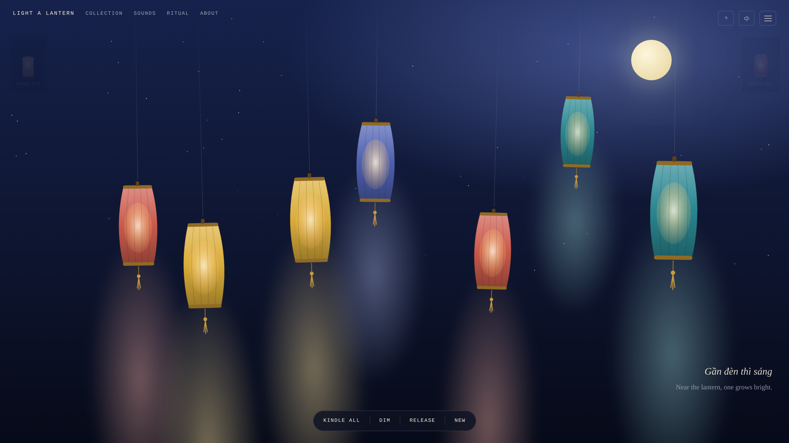

# Light a Lantern 🏮

A quiet, **single-file** meditation web app: a minimal moonlit night of silk
lanterns you tap to light, with warm ambient sound synthesized live in your
browser. It's a small ritual for slowing down, and for letting go.

**One `index.html`. No dependencies, no build step, no external assets.** Every
visual is inline SVG/CSS and every sound is generated at runtime with the Web
Audio API — so it runs fully **offline** by opening a single file.



**▶ Live demo:** <https://anelbazarbayeva95.github.io/light-a-lantern/>

## Try it locally

Open the file — that's the whole setup:

```bash
open index.html          # macOS
xdg-open index.html      # Linux
```

## What it does

- **Tap a lantern** to kindle a warm glow and a soft bell. Each silk colour is
  tuned to a different pitch, so lighting the night plays a gentle scale.
- **Kindle all · Dim · Release · New** — light or quiet the whole scene, let the
  lit lanterns drift up and fade (a "letting go" gesture), or gather a fresh set.
- **Ambient soundscapes**, layerable and all synthesized: 🌧 rain · 🛕 temple
  drone · 🔔 chimes · 🦗 night crickets.
- **Breathing guide** — Box (4·4·4·4) or 4·7·8, with an adjustable pace and a
  pulsing centre cue.
- **Session timer** — 5 / 10 / 20 / 45 min, closing with a deep resonant gong.
- **Mood presets** (Focus · Unwind · Sleep · Festival) set colour, density,
  breathing and sound in one tap.

## The Collection — lanterns of the world

Ten cultural styles, each with its own **silhouette**, palette, signature
**soundscape**, **night sky**, history note, and a native-script **proverb**
surfaced on the scene:

| Culture | Lantern | Culture | Lantern |
|---|---|---|---|
| 🇻🇳 Vietnam | Hội An | 🇮🇳 India | Akash Kandil |
| 🇨🇳 China | Dēnglóng | 🇹🇭 Thailand | Khom Loi |
| 🇯🇵 Japan | Chōchin | 🇲🇦 Morocco | Pierced metal |
| 🇯🇵 Japan | Andon | 🇵🇭 Philippines | Parol |
| 🇰🇷 Korea | Cheongsachorong | 🇲🇽 Mexico | Farolito |

Travel between them from the Collection panel, by **swiping** left/right, with the
**← →** arrow keys, or via the prev/next preview cards in the top corners.

## How it works

The interesting part is the constraint: **everything ships in one 65 KB HTML
file**, generated at runtime.

- **Procedural SVG lanterns.** `lanternSVG(kind, silk)` builds each of the ten
  silhouettes from a small set of shared helpers (`barrel`, `vribs`, `core`,
  `goldCap`, `tassel`). Lit/unlit is pure CSS: three layered elements — a `.silk`
  body, a `.core` warm glow, and a `.scrim` dark overlay — toggle on a single
  `.lit` class. The same function renders the mini icons in the preview cards.
- **Live audio, never sampled.** An `AudioContext` is created lazily on first
  gesture. Bells and the closing gong are additive-partial synths; rain, drone,
  chimes and crickets are built from filtered noise and oscillators, each
  returning a `{stop()}` handle. There are no audio files.
- **A registry-driven scene.** A single `STYLES` object defines each culture
  (shape, palette, sky gradient, moon position, sound, note, proverb). Switching
  culture recolours the palette, cross-fades the sky, glides the moon,
  repositions the stars, and swaps the whole scene with a staggered
  rise-in/drift-out transition.
- **One mutable `state` object** drives everything; the whole app is a single
  IIFE with no framework.

## Notes

- Respects `prefers-reduced-motion` (sway, twinkle, flicker and drift disabled).
- Keyboard-navigable, with ARIA labels throughout.
- A deliberate single dark "night" world — there's no light theme, by intent.
- Audio starts on your first interaction, per browser autoplay rules.

## License

MIT — do what you like; a kind word is appreciated.
